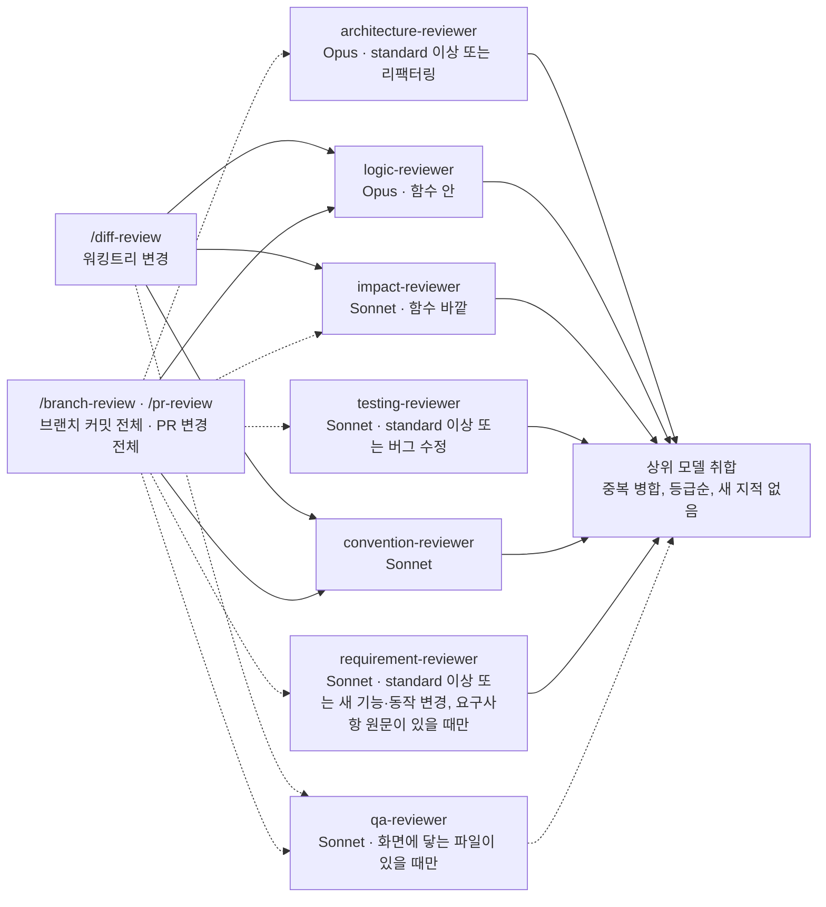

# 리뷰 설계

[`/diff-review`](../diff-review/SKILL.md)·[`/branch-review`](../branch-review/SKILL.md)·[`/pr-review`](../pr-review/SKILL.md) 세 리뷰 스킬을 어떻게 나눴고 왜 그렇게 짰는지 적은 문서입니다. 스킬로 로드되지 않으며, 실행 절차는 각 `SKILL.md`와 [`verify.md`](verify.md)에 있습니다.

## 흐름

범위에 따라 스킬이 갈립니다. 커밋 전이면 [`/diff-review`](../diff-review/SKILL.md), PR을 올리기 전 브랜치 전체면 [`/branch-review`](../branch-review/SKILL.md), 올라온 PR이면 [`/pr-review`](../pr-review/SKILL.md)입니다. 스킬 이름이 곧 범위 선언이라 대상을 되묻는 단계가 없습니다.

- **범위와 축**: 각 스킬이 자기 범위를 고정된 명령으로 확정합니다. 축도 스킬마다 다릅니다. 커밋 전은 코드 레벨·영향 범위·컨벤션 세 축만 보고, 나머지 둘은 작업 규모와 유형에 따라 축을 고릅니다. standard 이상이면 아키텍처·테스트·요구사항까지 여섯 축을 모두 보고, small이면 코드 레벨·영향 범위·컨벤션에 유형에 맞는 축 하나를 더하며, trivial이면 어느 스킬이든 서브에이전트 없이 상위 모델이 직접 봅니다. 규모는 `requirements.md` 머리에 적힌 값과 diff를 잰 값 가운데 큰 쪽을 씁니다. 확정한 diff는 파일로 한 번 떠서, 모든 축이 같은 스냅샷을 보게 합니다.
  - **부록**: 화면에 닿는 변경이면 `qa-reviewer`를 함께 띄워 브라우저에서 확인할 목록을 만듭니다. 지적이 아니므로 검증과 등급을 거치지 않고 리포트 맨 뒤에 붙습니다.
- **병렬 리뷰**: 각 축이 자기 영역만 보도록 격리된 서브에이전트가 병렬로 봅니다. 축마다 모델을 따로 지정합니다. 함수 안의 실행 경로를 따라가며 판단해야 하는 코드 레벨 축과, 정답이 정해져 있지 않은 설계 판단을 내리는 아키텍처 축은 Opus로 두고, 문서·설정·인접 코드·Grep 결과와 대조하면 끝나는 나머지 축은 Sonnet으로 내립니다.
- **취합**: 축이 하나씩 도착하는 동안 중간 보고를 하지 않고 전부 모일 때까지 기다립니다. 도착할 때마다 한 턴씩 쓰면 그만큼 끝이 밀립니다. 결과가 다 오면 상위 모델이 중복을 합치고 등급 순으로 하나의 리포트에 정리합니다. 등급은 에이전트가 붙이지 않고, 각 축이 낸 사실을 상위가 하나의 기준으로 환산합니다. 이 단계에서 새 지적은 만들지 않고, 상반된 결론은 억지로 해소하지 않고 나란히 둡니다.
- 대상 고정부터 취합·출력까지는 세 스킬이 [`verify.md`](verify.md) 하나를 공유합니다. 각 스킬 문서에는 범위와 축만 적혀 있습니다.

## 스킬별 축

[`deep-dive.md`](../planning-dev/sub/deep-dive.md)의 서브에이전트 분석과 리뷰 축은 같은 구조를 공유합니다. 격리된 서브에이전트가 병렬로 보고, 상위 모델은 취합만 합니다. 아래는 리뷰 축을 스킬별로 펼친 것으로, 어느 스킬이 어느 에이전트를 어느 모델로 부르는지를 나타냅니다.

`/branch-review`와 `/pr-review`는 보는 범위만 다르고 축 구성이 같아서 한 노드로 묶었습니다. 점선으로 들어가는 화살표는 조건이 맞을 때만 호출된다는 뜻입니다. 아키텍처·테스트·요구사항 축은 규모가 standard 이상이면 항상 부르고, small이면 작업 유형에 맞는 하나만 부릅니다. 규모가 trivial이면 도표의 어느 에이전트도 부르지 않고 상위 모델이 직접 봅니다. `impact-reviewer`로 들어가는 화살표가 `/pr-review` 쪽에서만 점선인 이유는, 남의 PR을 체크아웃하지 않고 diff만으로 볼 때는 이 축을 부르지 않기 때문입니다. `qa-reviewer`에서 나가는 화살표도 점선인데, 이 결과는 지적이 아니라서 검증과 등급을 거치지 않고 리포트 맨 뒤에 그대로 붙기 때문입니다.

노드에 붙은 모델 이름은 그 축을 어느 모델로 띄우는지를 뜻하며, [`agents/`](../../agents/)의 각 정의 앞머리에 적혀 있습니다.

## 코드 레벨 축과 영향 범위 축을 가르는 기준

두 축은 맞닿아 있어서 한 문장으로 가릅니다. **함수 하나를 열어 판정되면 코드 레벨 축이고, 바깥을 찾아봐야 판정되면 영향 범위 축입니다.**

| 보는 것                                             | 축     |
| --------------------------------------------------- | ------ |
| 경계값, off-by-one, 널·옵셔널, 타입, 분기 로직      | logic  |
| 함수 안에서 닫히는 예외 처리, `await` 누락          | logic  |
| 시그니처·반환·예외 계약이 바뀌어 기존 호출부가 깨짐 | impact |
| 지우거나 이름을 바꾼 심볼의 잔존 참조               | impact |
| 전역·캐시·설정 같은 공유 상태 오염                  | impact |
| API 응답 형식, 이벤트 페이로드, DB 스키마 변경      | impact |

아키텍처 축에도 비슷해 보이는 `확장 비용` 항목이 있지만 뜻이 다릅니다. 그쪽은 "같은 요구가 또 오면 몇 군데를 고쳐야 하는가"라는 앞으로의 비용이고, 영향 범위 축은 **지금 이 변경으로 이미 깨진 곳**을 봅니다.

영향 범위 축은 근거가 약한 것을 지적으로 올리지 않습니다. 참조 지점을 찾았으나 그 경로가 실제로 실행되는지 단정하지 못하면 `[impact-확인]`으로 따로 내고, 상위는 그것을 리포트 맨 뒤 "확인 필요"에 모읍니다.

## 왜 축을 이렇게 나눴는가

과거 세션 기록에서 축별 소요 시간을 재어 정했습니다. 병렬로 띄워도 전체가 끝나는 시점은 가장 느린 축이 정하므로, 축을 더 늘리는 것보다 편차를 줄이는 것이 전체 시간에 듣습니다.

| 축                    | 분리 전 중앙값 | 조치                                   |
| --------------------- | -------------- | -------------------------------------- |
| logic-reviewer        | 449초          | 호출부 추적을 impact로 이관, Opus 유지 |
| testing-reviewer      | 332초          | Sonnet                                 |
| convention-reviewer   | 288초          | Sonnet                                 |
| requirement-reviewer  | 272초          | Sonnet                                 |
| architecture-reviewer | 264초          | Opus                                   |

코드 레벨 축이 유독 느렸던 원인은 호출부를 열어 확인하는 왕복이었고, 그 일이 곧 영향 범위 축의 본업입니다. 그래서 축을 나눈 것은 품질 공백을 메우는 동시에 가장 느린 축의 짐을 덜어내는 일이기도 합니다. 반대로 나머지 축을 Sonnet으로 내린 것은 전체 시간보다 토큰 비용에 듣는 조치입니다.

아키텍처 축은 Opus로 둡니다. 모듈 경계나 확장 비용처럼 정답이 정해져 있지 않은 판단을 맡는 축이기 때문입니다. 전체 시간은 가장 느린 코드 레벨 축이 정하므로, 이 선택으로 늘어나는 것은 주로 토큰 비용입니다.
